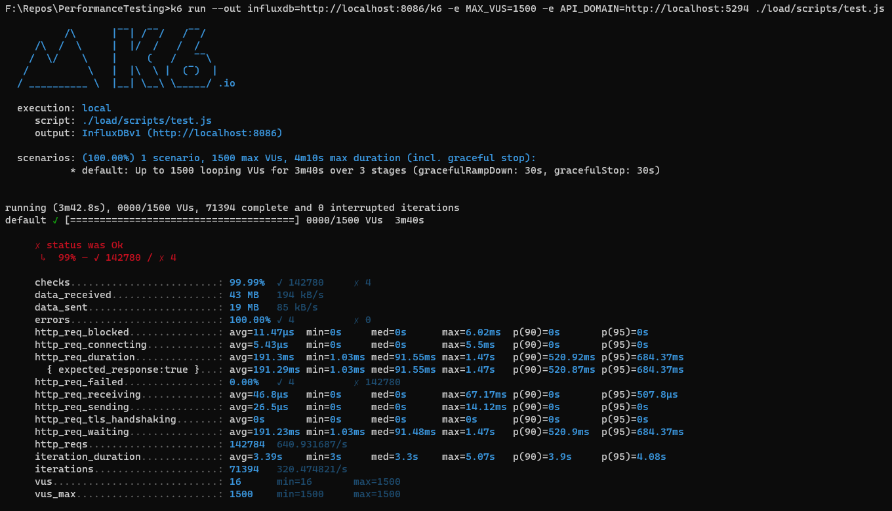
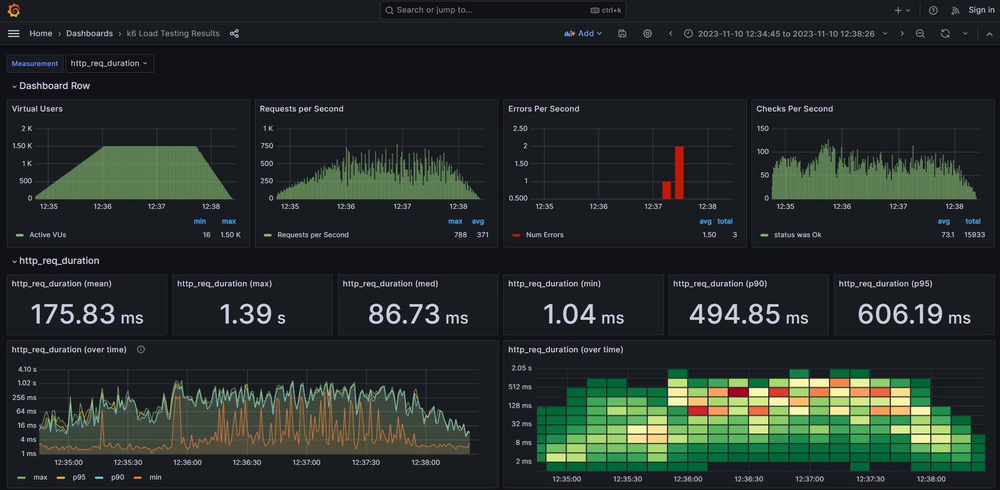

# Performance Testing

This repository provides an example of how to Load test an API using k6, Grafana and WireMock.

An example Weather API is used which makes requests to Open-Meteo, an Open Source Weather service. WireMock is used to mock Open-Meteo so that consistent Load metrics can be achieved when testing.

The example Weather API can be run using Docker. The test scripts and load test components can also be run using Docker.

## Load Test Components

- **API** - ASP.NET Weather API. Can be accessed using http://localhost:5294/swagger/index.html
- **Database** - MongoDB database used to store weather forecast requests
- **k6** - Go based performance and automation testing framework
- **WireMock"" - Used to mock Open-Meteo responses when load testing
- **InfuxDB** - Time series database used to store load test metrics
- **Grafana** - Used for dashboard view of load test metrics

## Running Locally

All of the components can be run using Docker via docker-compose.

### Running API and Database

The *local* docker-compose profile can be used to run the API and MongoDB database:

```bash
docker-compose --profile local up -d
```

### Running Load Test Components

The *load-local* docker-compose profile can be used to the load testing components required for storing metrics from k6:

```bash
docker-compose --profile load-local up -d
```

### Running k6 Load Test

The `test.js` script is used for the load test. This can be run using Docker or directly using the k6 CLI. 

The steps for installing k6 can be found here: https://k6.io/docs/get-started/installation/

```bash
k6 run --out influxdb=http://localhost:8086/k6 -e MAX_VUS=1500 -e API_DOMAIN=http://localhost:5294 ./load/scripts/test.js
```

MAX_VUS can be changed to alter the number of concurrent users used for the load test.



## Load Test

The test is designed to run over 3 stages:
- **Ramp-Up** - Ramp up the concurrent users gradually
- **Main** - Run consistent load using the max concurrent users
- **Ramp-Down** - Ramp down the concurrent users gradually to zero

## Viewing Load Test Results

The output from the Load test can be viewed using Grafana:

(http://localhost:3000)

